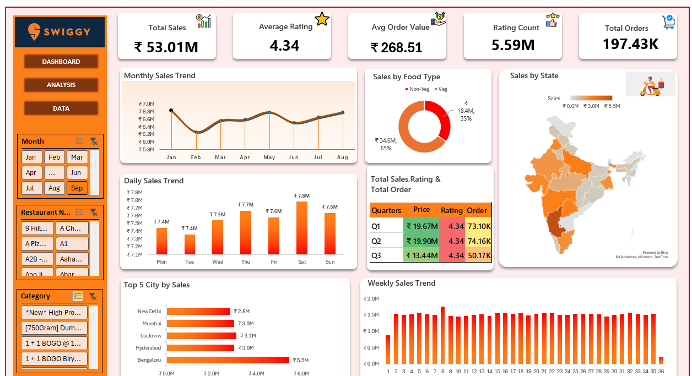

# Swiggy Sales & Order Analytics Dashboard

An interactive **Excel dashboard** built to analyze Swiggy sales, orders, ratings, food types, cities, states, and category-level performance.

## 📌 Project Overview

This project analyzes **197K+ Swiggy order records** using **Microsoft Excel**. The dataset was cleaned and analyzed using PivotTables, followed by the development of an interactive dashboard to identify key sales and order trends.

## 🛠️ Tools & Techniques

- **Microsoft Excel**
- **Data Cleaning**
- **PivotTables**
- **Slicers & Filters**
- **KPI Cards**
- **Data Visualization**
- **Interactive Dashboard**

## 📊 Key Metrics

| Metric | Value |
|---|---:|
| Total Sales | ₹53.01M |
| Total Orders | 197.43K |
| Average Order Value | ₹268.51 |
| Average Rating | 4.34 |

## 🔍 Analysis Performed

The dashboard provides analysis of:

- Monthly Sales Trends
- Daily Sales Trends
- Weekly Sales Trends
- Sales by Food Type
- Sales by State
- Top 5 Cities by Sales
- Quarterly Sales & Orders
- Ratings & Category Performance
- Restaurant-level Performance

## 💡 Key Insights

- **Non-Veg orders contributed 65% of total sales**, while Veg orders contributed 35%.
- **Bengaluru** recorded the highest sales among the top 5 cities, generating approximately **₹5.5M**.
- **Q2 recorded the highest quarterly sales**, generating approximately **₹19.90M**.

## 📷 Dashboard Preview

## 🎯 Project Objective

The objective of this project was to apply **data cleaning, PivotTable-based analysis, and data visualization** in Excel to transform raw Swiggy order data into an interactive business dashboard and derive actionable sales insights.

## 📁 Project Files

- `Swiggy_Sales_Order_Analytics.xlsx` — Excel workbook containing the cleaned data, analysis, PivotTables, and dashboard.
- `Dashboard_swiggy.png` — Dashboard preview.

## 👤 Author

**Mayank Sinha**

**Data Analytics | Excel | SQL | Python | Power BI**
